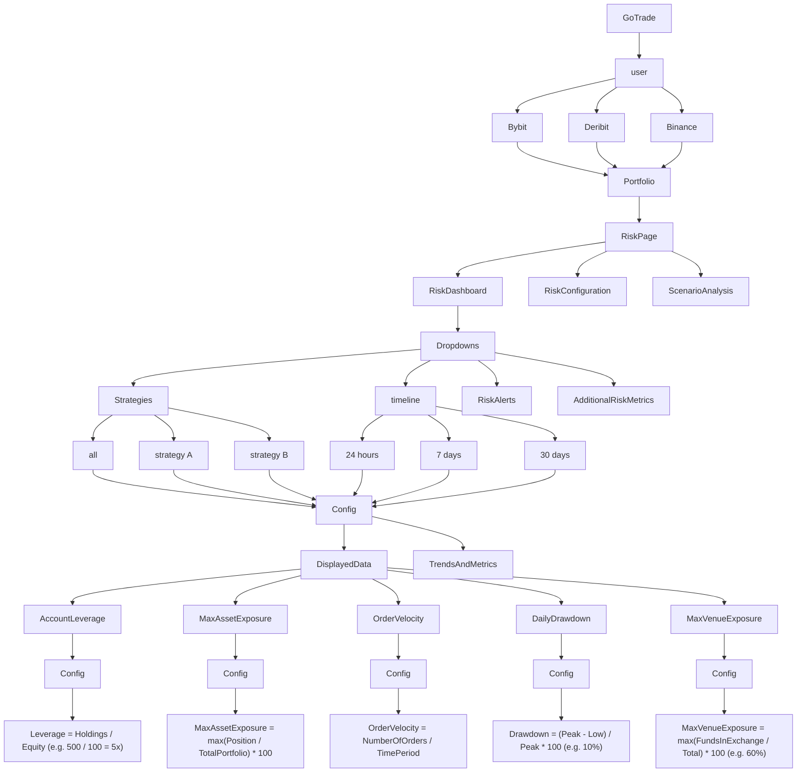

```mermaid
graph TD
  %% Users and Platforms
  user --> Bybit
  user --> Deribit
  user --> Binance
  GoTrade --> user

  %% Portfolio
  Bybit --> Portfolio
  Deribit --> Portfolio
  Binance --> Portfolio

  %% Risk Section
  Portfolio --> RiskPage
  RiskPage --> RiskDashboard
  RiskPage --> RiskConfiguration
  RiskPage --> ScenarioAnalysis

  %% Risk Dashboard Details
  RiskDashboard --> Dropdowns
  Dropdowns --> Strategies
  Dropdowns --> timeline
  Dropdowns --> RiskAlerts
  Dropdowns --> AdditionalRiskMetrics

  timeline --> t_24h["24 hours"]
  timeline --> t_7d["7 days"]
  timeline --> t_30d["30 days"]

  Strategies --> all_strategies["all"]
  Strategies --> strategy_A["strategy A"]
  Strategies --> strategy_B["strategy B"]

  t_30d --> Config
  strategy_A --> Config
  strategy_B --> Config
  all_strategies --> Config
  t_24h --> Config
  t_7d --> Config

  Config --> DisplayedData
  Config --> TrendsAndMetrics

  %% Displayed Data Metrics
  DisplayedData --> AccountLeverage
  DisplayedData --> MaxAssetExposure
  DisplayedData --> OrderVelocity
  DisplayedData --> DailyDrawdown
  DisplayedData --> MaxVenueExposure

  %% Metrics Config
  AccountLeverage --> AL_Config["Config"]
  AL_Config --> AL_Formula["Leverage = Holdings / Equity (e.g. 500 / 100 = 5x)"]

  MaxAssetExposure --> MAE_Config["Config"]
  MAE_Config --> MAE_Explanation["MaxAssetExposure = max(Position / TotalPortfolio) * 100"]

  OrderVelocity --> OV_Config["Config"]
  OV_Config --> OV_Formula["OrderVelocity = NumberOfOrders / TimePeriod"]

  DailyDrawdown --> DD_Config["Config"]
  DD_Config --> DD_Formula["Drawdown = (Peak - Low) / Peak * 100 (e.g. 10%)"]

  MaxVenueExposure --> VE_Config["Config"]
  VE_Config --> VE_Explanation["MaxVenueExposure = max(FundsInExchange / Total) * 100 (e.g. 60%)"]

  %% Trends & Metrics Visuals
 
```